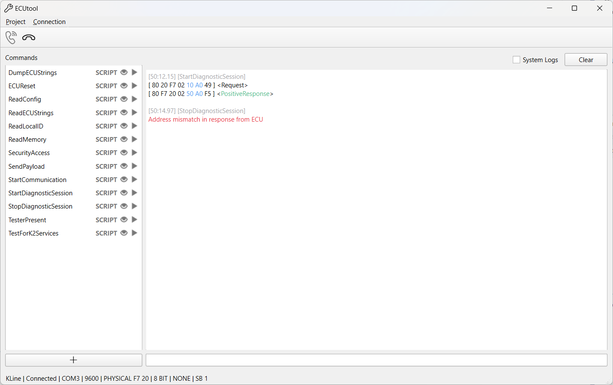

# About

ECUtool is a GUI-based tool allowing you to define commands to communicate with various ECUs using different protocols.
Currently, protocols using the K-Line are most supported. Example projects are included [here](./ecutool_projects).

# Prerequisites

- Qt must be installed and Qt bin in system PATH
- Cmake

# Setup

- Clone the repository `git clone [this url]`
- Navigate to ECUtool directory `cd ecutool`
- Initialise submodules `git submodule update --init --recursive`
- Bootstrap vcpkg `cd vcpkg`
    - Windows: `bootstrap-vcpkg.bat`
    - Unix: `./bootstrap-vcpkg.sh`

# Build

- Command line `ecutool` directory run `cmake --build .`
- Otherwise use an IDE supporting cmake such as Visual Studio 2022 or CLion
